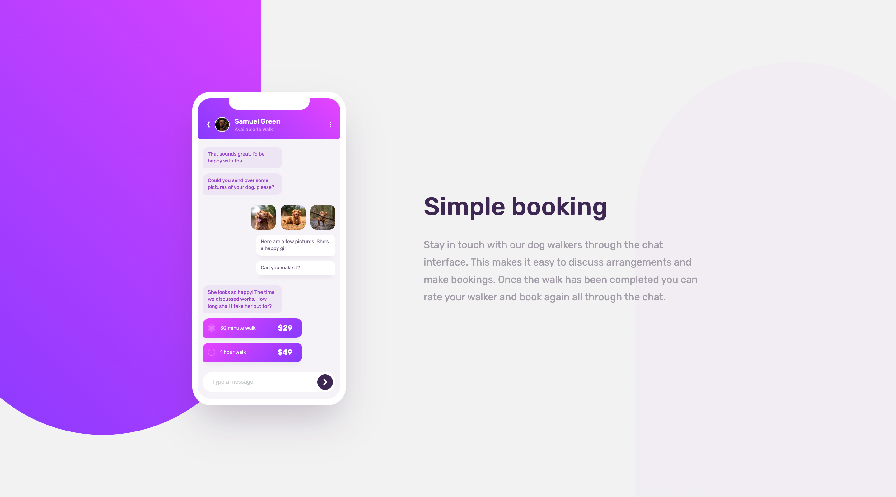

# Chat app CSS illustration solution

This is a solution to the [chat app CSS illustration challenge on Frontend Mentor](https://www.frontendmentor.io/challenges/chat-app-css-illustration-O5auMkFqY). Frontend Mentor challenges help you improve your coding skills by building realistic projects.

## Table of contents

- [Overview](#overview)
  - [The challenge](#the-challenge)
  - [Screenshot](#screenshot)
  - [Links](#links)
- [My process](#my-process)
  - [Built with](#built-with)
- [Author](#author)

## Overview

### The challenge

Users should be able to:

- View the optimal layout for the component depending on their device's screen size
- **Bonus**: See the chat interface animate on the initial load

### Screenshot

### Links

- [Solution URL](https://github.com/annaindistress/frontend-mentor-chat-app-css-illustration)
- [Live Site URL](https://annaindistress.github.io/frontend-mentor-chat-app-css-illustration/)

## My process

### Built with

- Semantic HTML5 markup
- Flexbox
- CSS Grid
- Mobile-first workflow
- Gulp
- SCSS

## Author

- Frontend Mentor - [@annaindistress](https://www.frontendmentor.io/profile/annaindistress)
- Twitter - [@annaindistress](https://www.twitter.com/annaindistress)
